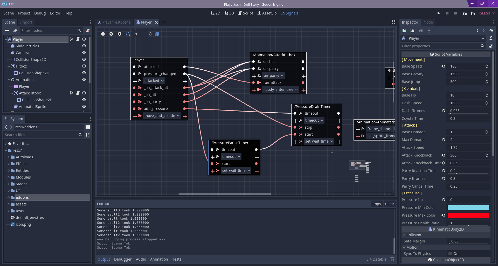

# Godot Signal Mapper [WIP]
A fun little tool to visualize signal connections in a scene. Honestly it's probably not that useful, but it does look cool. 
I'll implement actual signal creation functions if I find a case where it could actually be useful.

## Installation
1. Clone the repository.
2. Copy `addons/signal-mapper` into your project's `addons` folder. (Or create one if it doesn't exist)
3. Activate the plugin from your project's setting page.
